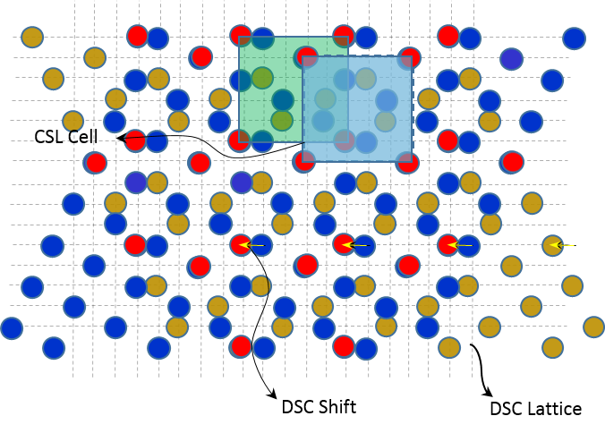

=======
GBpy
=======
GBpy is a python package for finding the geometrical properties of
a Bicrystal. It includes all the necessary tools for constructing a simulation box
for grain boundary simulation.

Functions:
----------------------
* ``GBpy.bp_basis``, collection of functions for calculating the basis vectors of a single or bicrystal (general lattices).
* ``GBpy.find_csl_dsc``, collection of functions for finding the CSL and DSC lattices of a bicrystal (general lattices).
* ``GBpy.generate_symm_ops``, a function for constructing various group symmetry operations.
* ``GBpy.geometry.quaternion``, collection of functions for quaternion operations.
* ``GBpy.misorient_fz``, function for finding the unique disorientations in fundamental zone of various crystal point groups.
* ``GBpy.integer_manipulations``, collection of many useful ineteger manipulation functions.

and many other useful tools. Please refer to the documentation and example for detailed description and utility of functions.

Classes:
~~~~~~~~~~~~~~~~~~~~~

- ``lattice``: Includes all the crystallographic data required for an element used by the code.
- ``quaternion``: Quaternion construction and operations.

How To Use This Package
----------------------

1. Clone the repository:

          $ git clone https://github.com/adehgha/GBpy.git

2. Run the setup script.	

          $ python setup.py
          
3. Import the package: 

          >>> import GBpy
          
4. Call the function by using:

          >>> GBpy.<name_of_the_function>
	for example to find the 2D basis vectors of a plane with Miller indices of (h,k,l):

          >>> GBpy.bp_basis.bp_basis([h,k,l])

5. You can also use the tools provided in this package individually by importing the functions separately. For example use :``from GBpy import <name_of_the_function> as foo``.

Consult the documentation for further details.

Prerequisites
----------------------

1. install ``numpy`` from `here. <http://www.numpy.org/>`__

2. install ``scipy`` from `here. <http://www.scipy.org/>`__

3. install ``setuptools`` from `here. <https://pypi.python.org/pypi/setuptools>`__

Authors:
----------------------
* `Srikanth Patala <spatala@ncsu.edu>`__, `web address:<http://patala.org/>`__.
* `Arash D Banadaki <adehgha@ncsu.edu>`__

Copyright (c) 2014,  Arash Dehghan Banadaki and Srikanth Patala.
